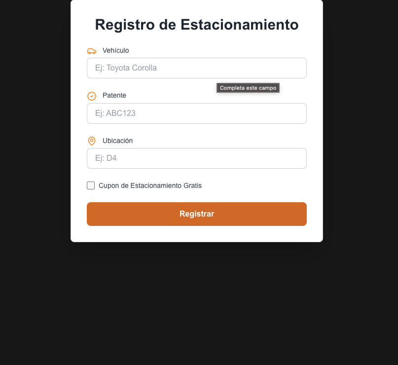

🚗 Estacionamiento Frontend

Este es un frontend desarrollado en Next.js que permite ingresar un vehículo, su patente y ubicación a través de un formulario para ser almacenado en el backend. 🚀

📌 Características

✅ Formulario para ingresar vehículo, patente y ubicación.

✅ Conexión con el backend en Django.

✅ Estilizado con Tailwind CSS.

✅ Validación de datos antes del envío.

⚙️ Instalación

🔧 Requisitos previos

💻 Node.js 16+

📦 npm o yarn

🚀 Configuración del entorno

Instalar dependencias:

npm install  # o yarn install

Configurar el archivo .env.local con la URL del backend:

NEXT_PUBLIC_API_URL=http://127.0.0.1:8000/

🏁 Uso

▶️ Iniciar el servidor de desarrollo

npm run dev  # o yarn dev

El frontend estará disponible en http://localhost:3000/

 🖼️ Imagen de referencia

🤝 Contribuciones

Si deseas contribuir, abre un issue o un pull request con mejoras o correcciones. 🚀

📜 Licencia

📝 MIT

